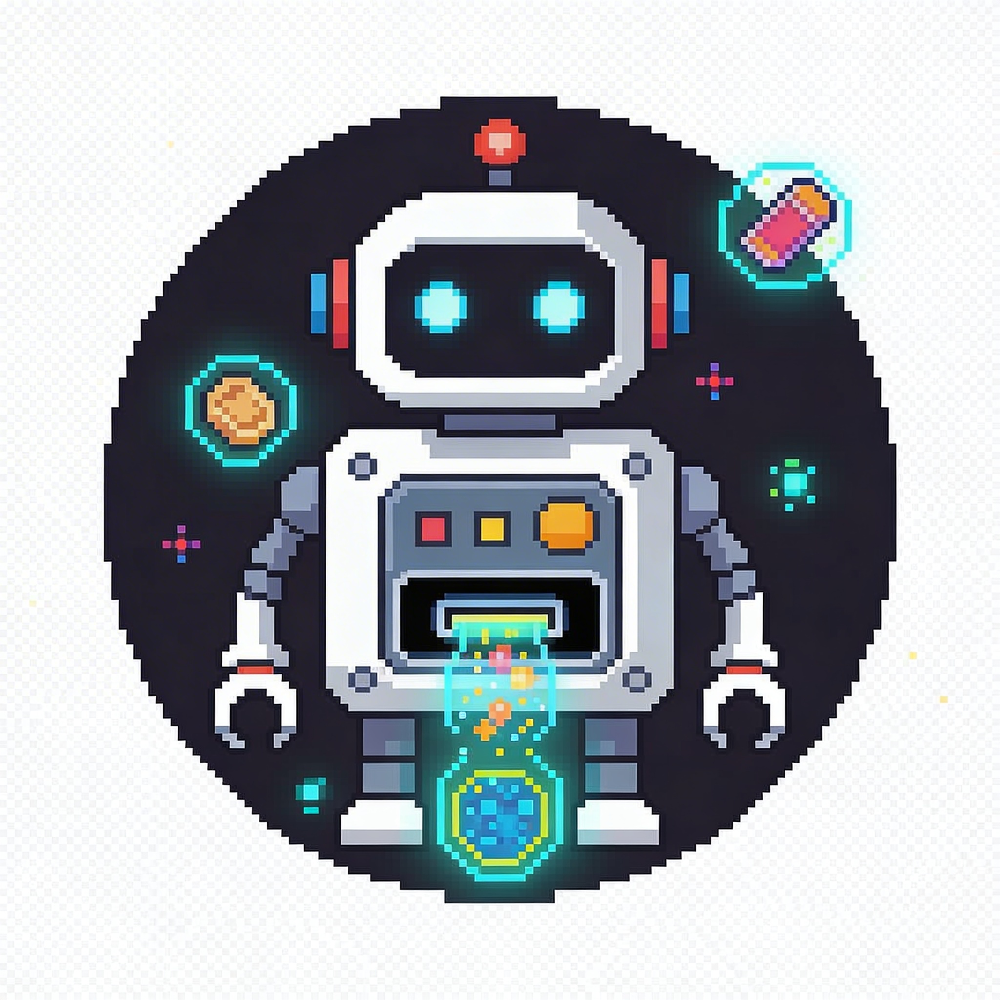

# Rep-li-bot



A local-first desktop application for building private apps and widgets without coding. Rep-li-bot uses AI to generate custom applications based on your descriptions, keeping everything local and private.

## Features

- **No-Code App Building** - Describe what you want in plain English, and Rep-li-bot generates the code
- **Local & Private** - All apps run locally; your data never leaves your machine
- **AI-Powered** - Uses OpenAI-compatible APIs (including Codex/ChatGPT) for code generation
- **Desktop-First** - Built as an Electron application for a native desktop experience
- **Widget Support** - Create lightweight widgets and mini-apps for personal use
- **Secure Runtime** - Sandboxed preview harness with proper permission boundaries
- **Windows Installer** - NSIS-based installer with AI provider configuration

## Tech Stack

- **Electron** - Desktop application framework
- **React 18** - UI rendering
- **TypeScript** - Type-safe codebase
- **Vite** - Fast build tooling
- **Vitest** - Unit testing

## Getting Started

### Prerequisites

- Node.js 18+
- npm 9+
- OpenAI-compatible API key (ChatGPT, Codex, etc.)

### Installation

```bash
# Clone the repository
git clone https://github.com/andyjm2k/Rep-li-bot.git
cd Rep-li-bot

# Install dependencies
npm install
```

### Development

```bash
# Run in development mode (starts Vite dev server + Electron)
npm run dev

# Run renderer only (for UI development)
npm run dev:renderer

# Run Electron only (requires dev server running)
npm run dev:desktop
```

### Building

```bash
# Build for production
npm run build

# Type checking
npm run typecheck

# Run tests
npm test
```

### Packaging

```bash
# Create unpacked Windows bundle
npm run dist:dir

# Create Windows installer (NSIS)
npm run dist:win
```

Output artifacts:
- Unpacked bundle: `release/win-unpacked/`
- Windows installer: `release/`

## Project Structure

```
replibot/
├── replibot.JPG        # Product logo
├── electron/           # Electron main process
│   ├── main.ts        # Main entry point
│   ├── preload.ts     # Secure IPC bridge
│   ├── aiStore.ts     # AI configuration store
│   ├── projectStore.ts # Project data store
│   └── openaiService.ts # OpenAI API integration
├── src/               # React renderer (frontend)
│   ├── App.tsx       # Root component
│   ├── components/   # UI components
│   ├── main.tsx      # React entry point
│   └── styles.css    # Global styles
├── shared/           # Shared types and utilities
│   ├── types.ts     # TypeScript definitions
│   ├── themes.ts     # Theme definitions
│   └── builder.ts    # Builder utilities
├── website/          # Marketing website (Astro)
│   ├── public/       # Static assets including logo and favicons
│   └── src/          # Pages, layouts, components
├── config/           # Configuration files
├── docs/             # Documentation
├── scripts/          # Build and packaging scripts
└── release/         # Built artifacts
```

## AI Configuration

Rep-li-bot uses a local OpenAI-compatible API configuration. The AI provider settings can be configured via:

1. **Installer Setup** - During installation on Windows
2. **Environment Variables** - For automated builds:
   - `REPLIBOT_AI_PROVIDER_LABEL` - Provider name
   - `REPLIBOT_AI_BASE_URL` - API endpoint
   - `REPLIBOT_AI_MODEL` - Model name
   - `REPLIBOT_AI_API_KEY` - API key

Settings are stored in `resources/config/installer.runtime.json` and take precedence over defaults.

## Architecture

See [docs/architecture.md](docs/architecture.md) for detailed architecture documentation.

## License

MIT License - see [LICENSE](LICENSE)
